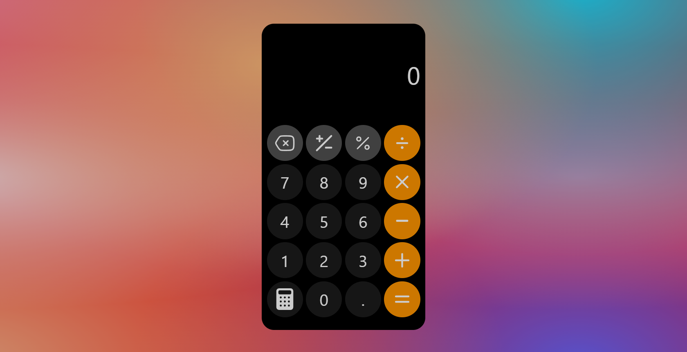

# Calculator

A browser-based calculator built with HTML, CSS, and JavaScript for [The Odin Project](https://www.theodinproject.com/) curriculum.

**Live Demo**: [https://wrzdx.github.io/calculator/](https://wrzdx.github.io/calculator/)


## Project Focus
- JavaScript logic implementation
- DOM manipulation
- Event handling

## Core Features
- Basic arithmetic operations (+, -, *, /)
- Clear and delete functionality
- Keyboard support

## Key Concepts Applied
✅ JavaScript event listeners  
✅ DOM element manipulation  
✅ Mathematical operation logic   
✅ Error handling  

## How to Run
1. Clone the repository:
   ```bash
   git clone https://github.com/wrzdx/calculator.git
   ```
2. Open `index.html` in your browser


